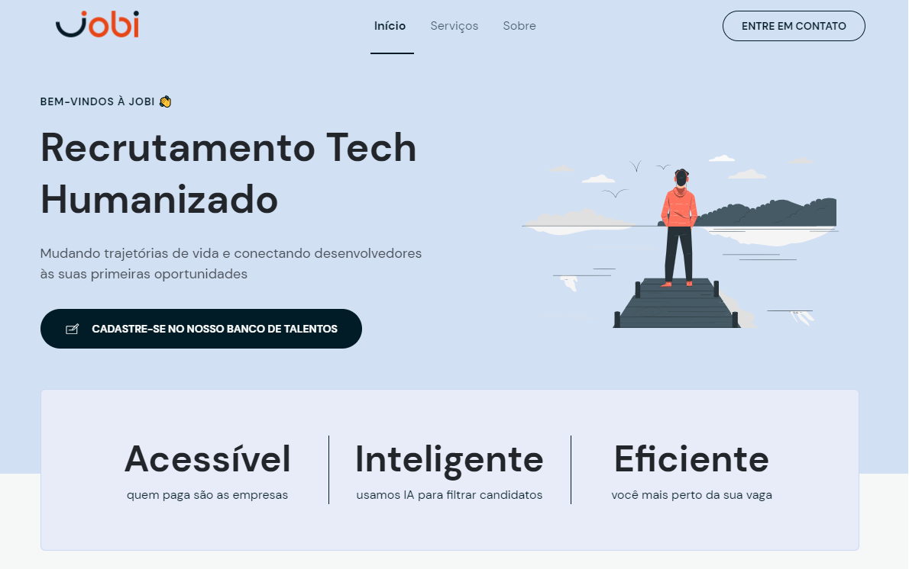

<h1 align="center">
    NLW Return · Mission: Origin · Extra-Mile
</h1>

    

 

<h3 align="center">
    Personal adaptation of the project developed   on the Origin path of NLW 8th edition
</h3>
 

    The project comprises a responsive landing page designed for Jobi, an HR Tech focused on landing beginner-level developers their first job.

 

The design was an adaptation of the original project presented by Rocketseat on the Origin path of the NLW Return.

 

---

<h3 align="center">Tech Stacks & Tools</h3>
    

    
     · 
    
     · 
    
     · 
    
    

---

<h3 align="center">About the Next Level Week</h3>

The Next Level Week (NLW) is an online event hosted by Rocketseat from time to time since June 2020. 

It consists of a whole week of practical programming-oriented content culminating in portfolio-ready projects which incorporates the latest and greatest trends in the IT market.

Its 8th edition (NLW Return) took place in May 2022, with two paths: Origin (beginner-level) and Impulse (advanced-level).

If you wanna know more, check out this <a href="https://blog.rocketseat.com.br/o-que-e-next-level-week/">Rocketseat's blog post</a> about it.

---

Made with 💜 Powered by ☕

--- 

<i> I'm am an open source enthusiast.</i> 🌱
 <i>Feel free to get inspiration from any aspect of this project! 
 Even so, be reasonable: do not just copy.
 Like academic writing, your work can incorporate the ideas of others 
 but should reflect your original approach to the problem.</i>

